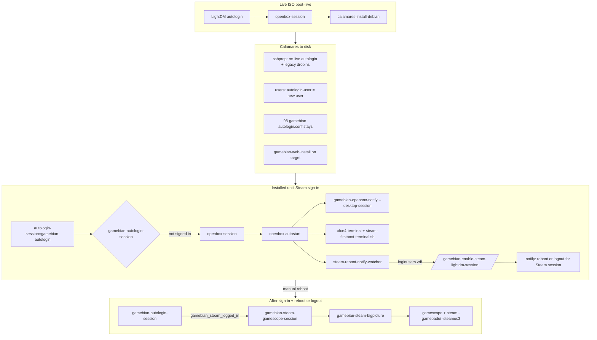

# GamebianOS

**GamebianOS** is Debian built for one job: install once, then boot like a console into **Steam Big Picture** inside **gamescope**. Same packages and mirrors as Debian; lightweight Openbox when you need a real desktop.

Think of it as a **game console image** on Debian rather than full desktop sprawl: sign in once, drive Steam with a controller, and keep a normal Openbox session when you need it.

It is still **Debian underneath** — same packages, mirrors, and tooling you already know — with a lightweight Openbox base, Calamares, and glue for LightDM, Steam, and gamescope.

## What it is

- **Debian underneath** — same packages, mirrors, and tooling you already know from Debian.
- **Streamlined on purpose** — a lightweight Openbox base, Calamares installer, and scripts that wire up LightDM, Steam, and gamescope.
- **Appliance-style flow** — after install, first boot walks you through Steam in a terminal; then the system prefers autologin into **gamescope + Steam** (SteamOS-style kiosk). Desktop mode stays available.

## What you get

| Stage | Experience |
|-------|------------|
| **Live ISO** | Try or install with the Gamebian overlay; Calamares installs to disk (`live` / `live`, usually autologin). |
| **First boot (disk)** | Openbox desktop, first-run Steam wizard (with install-time warnings), then reboot or logout. |
| **Everyday use** | Autologin into gamescope running Steam Big Picture (`-gamepadui`, `-steamos3`). Desktop mode stays available. |

Optional pieces include **gamebian-web** (`:8844`) for remote ROM/store setup and a controller-friendly launcher menu (Guide / Home).

## Who it’s for

- A **dedicated gaming PC** or handheld you treat like a console.
- Anyone who wants **Steam on Debian** without hand-rolling gamescope, i386, contrib/non-free, and session glue.
- Tinkerers who still want **real Debian** under the hood.

## Quick start (build the ISO)

```bash
cd Build/gambian-iso
./setup.sh
./build.sh    # or: sudo lb build from GAMEBIANOS_BUILD_ROOT
```

Default build output: `/home/khinds/gamebianos-build-iso` (override with `GAMEBIANOS_BUILD_ROOT`).

## Repository layout

| Path | Role |
|------|------|
| `Build/gambian-iso/` | Live-build profile: `overlay/`, `hooks/`, package lists |
| `Build/gambian-iso/setup.sh` | Merge overlay into `GAMEBIANOS_BUILD_ROOT`, Calamares, themes |
| `Build/gambian-iso/build.sh` | Run `lb build` |
| `Build/share/calamares-gamebian/` | Calamares modules and branding |
| `Build/share/gamebian/` | Controller menu, `ensure-apt-contrib-nonfree.sh` (canonical APT helper) |
| `Packages/gamebian-web/` | Web UI source (staged on ISO, installed by Calamares) |
| `scripts/gamebian-sync-installed.sh` | Push overlay changes to an installed system for testing |

## The complete journey (build → live ISO → installed console)

This is the full story of how **GamebianOS** gets from source tree to a gaming appliance.

### Step 0 — Build the hybrid ISO

From `Build/gambian-iso/`:

1. **`./setup.sh`** — Runs `lb config` for **Debian trixie**, merges `overlay/` (package lists, hooks, `includes.chroot` files), copies Calamares branding/modules from `Build/share/calamares-gamebian/`, stages `Packages/gamebian-web` at `/usr/src/gamebian-web` on the squashfs, generates color themes, and resets the live-build chroot.
2. **`./build.sh`** — Runs `sudo lb build` in `GAMEBIANOS_BUILD_ROOT` (default `/home/khinds/gamebianos-build-iso`). Output is a **hybrid ISO** you can dd to USB or boot in a VM.
3. **Hook 997** (during `lb build`, needs network) — Builds **gamescope** from GitHub, installs libretro cores from `debian-retroarch.list`, and optionally builds N64 / Dolphin libretro cores. Failures are logged but do not fail the image; missing gamescope sets `/etc/gamebian/steam-without-gamescope`.

The squashfs already contains: Openbox + LightDM, **Calamares**, `steam-installer`, session glue scripts, and (usually) a working `gamescope` binary. **gamebian-web is not running on the live session** — only its source is staged for Calamares.

### Step 1 — Boot the live ISO

| What happens | Detail |
|--------------|--------|
| Kernel cmdline | `boot=live` → every session script treats this as **live mode** |
| LightDM | `50-gamebian-live-autologin.conf` autologins user **`live`** / password **`live`** |
| Session | `gamebian-autologin-session` → always **`openbox-session`** on live |
| Desktop | lxpanel, network tray, controller menu; **Calamares** autostarts (`calamares-install-debian`) |
| Steam setup | **Skipped** — no first-boot terminal, no gamescope kiosk on live |
| Installer | Calamares requires **internet** (`welcome.conf`) before install proceeds |

### Step 2 — Calamares installs to disk

Calamares unpacks the live squashfs onto the target partition and runs (in order):

| Module | What it does for Gamebian |
|--------|---------------------------|
| `users` | Creates your user with **`doAutologin: true`** |
| `displaymanager` | Enables LightDM; greeter default session file is Openbox |
| `shellprocess@gamebian-network` | NetworkManager permissions |
| `shellprocess@gamebian-apt-sources` | Enables **i386**, **contrib**, **non-free** |
| `packages` | Extra target packages including `steam-installer` |
| `shellprocess@gamebian-sshprep` | Removes live autologin + legacy LightDM drop-ins; chmods session scripts; runs **`gamebian-install-steam`** (fast if already on squashfs) |
| `shellprocess@gamebian-gamescope` | Rebuilds gamescope on target if missing (up to 7200s timeout) |
| `shellprocess@gamebian-web` | pip-installs **gamebian-web**, enables `:8844` service |

After install, **`98-gamebian-autologin.conf`** remains: autologin session = **`gamebian-autologin`** (the dispatcher), not gamescope directly. Calamares is **purged** from the installed system.

### Step 3 — First boots on disk (Openbox until Steam is ready)

On every installed boot, LightDM autologins → **`gamebian-autologin-session`**, which checks gates (below). Until both gates pass, you get **Openbox only**.

**Openbox autostart** (installed disk, every Openbox login):

1. **`gamebian-openbox-notify.sh --desktop-session`** — three libnotify messages (welcome, web UI `:8844`, reboot/logout hint).
2. **Once only** (marker `~/.config/gamebian-firstboot-steam.prompted`): opens **`xfce4-terminal`** running **`steam-firstboot-terminal.sh`**, titled **Install Steam** or **Steam setup**, with a **`notify-send`** warning that apt + Steam updates can take several minutes.
3. **`gamebian-steam-reboot-notify-watcher.sh`** — polls for Steam sign-in in the background.

**Inside `steam-firstboot-terminal.sh`:**

- Prints a banner about long installs and background Steam updates.
- Runs **`gamebian-install-steam`** if `steam` is not on PATH (sudo prompt).
- Starts **Steam** in the foreground; user installs updates and **signs in**, then quits Steam.
- When **`loginusers.vdf`** exists, calls **`gamebian-enable-steam-lightdm-session`** (needs sudo once) and sets marker files.
- Shows reboot/logout instructions — **nothing auto-reboots**.

### Step 4 — Gamescope gating (when autologin stays on Openbox)

Autologin enters **gamescope + Steam Big Picture** only when **`gamebian_steam_kiosk_ready`** is true (`gamebian-steam-ready.sh`). All of the following must hold:

| Gate | Check | If it fails |
|------|-------|-------------|
| Not live | `boot=live` absent | N/A on installed disk |
| Steam binary | `steam` on PATH or under `~/.steam/` / `~/.local/share/Steam/` | Openbox + setup terminal |
| Bootstrap done | No `.needs-steam-bootstrap`, no running `steam bootstrap` | Openbox (Steam still downloading) |
| **Signed in** | **`loginusers.vdf`** in Steam config dir | Openbox + setup terminal / watcher |
| Desktop override | `~/.config/gamebian/prefer-openbox-desktop` absent | Openbox even when signed in |

**Partial setup examples:**

- **Steam apt installed but never launched** → Openbox; terminal offers install/run.
- **Steam running, updates downloading in background** → Openbox (`gamebian_steam_bootstrap_pending`).
- **Steam installed, user closed without signing in** → Openbox; no `loginusers.vdf`.
- **Signed in but user never ran sudo enable** → Openbox; watcher/terminal prompt `sudo gamebian-enable-steam-lightdm-session`.
- **Signed in + markers set, no reboot yet** → Still Openbox until logout/reboot (dispatcher unchanged until new login).

**Safety net:** Even if LightDM somehow starts **`gamebian-steam-gamescope-session`** early, that script and **`gamebian-steam-bigpicture`** re-check sign-in and **`exec openbox-session`** if not ready.

### Step 5 — Everyday use (gamescope kiosk)

After **sign-in + logout or reboot**:

1. `gamebian-autologin-session` → **`gamebian-steam-gamescope-session`** → **`gamebian-steam-bigpicture`**
2. **gamescope** runs as full compositor + Steam with **`-gamepadui -steamos3`** (SteamOS-style power menu)
3. Controller menu is **suppressed** in exclusive kiosk

If gamescope failed at build/install time, **`/etc/gamebian/steam-without-gamescope`** forces fullscreen Steam on X without compositor.

### Step 6 — Switching between Steam and Desktop

| From → To | How | Next boot default? |
|-----------|-----|-------------------|
| **Steam → Desktop** | Steam power menu → **Switch to Desktop** → `steamos-session-select desktop` → `gamebian-steam-switch-to-desktop` (sets `switch-to-openbox`, kills gamescope; **never** blocks on `steam -shutdown`) → `gamebian-steam-bigpicture` hands off to **`openbox-session`** on same LightDM login | **No** — still autologin to gamescope |
| **Desktop → Steam (now)** | Controller menu → **Enter Steam (gamescope)** → `gamebian-enter-steam-kiosk-session` | Enables steam preference; starts kiosk on current display |
| **Desktop → Steam (next boot)** | Steam menu → **Return to gaming mode** / `steamos-session-select gamescope` | **Yes** — and starts kiosk now when `DISPLAY` is set |
| **Always boot to Desktop** | `sudo gamebian-enable-openbox-lightdm-session` | **Yes** — sets `prefer-openbox-desktop` |
| **Greeter** | Choose **Desktop** or **Steam** at login screen | Current session only |

**Desktop → Steam from Openbox:** Controller menu or `steamos-session-select gamescope` ends Openbox (`openbox --exit`) so LightDM autologins gamescope — no stacked window managers.

---

## Building the ISO

This repository holds the live ISO profile, Calamares modules, overlay scripts, and themes.

After `lb build`, verify optional libretro cores on the squashfs:

```bash
# N64 (compiled during hook 997 — needs network + nasm)
grep -E 'verify OK|failed|nasm' /var/log/gamebian-install-mupen64plus-next.log
test -f /usr/lib/x86_64-linux-gnu/libretro/mupen64plus_next_libretro.so

# GameCube / Wii (buildbot download during hook 997)
test -f /usr/lib/x86_64-linux-gnu/libretro/dolphin_libretro.so
```

Hook order (lexicographic): **992** grub branding → **993** bluetooth → **994** gamescope path → **995** apt contrib → **996** inotify → **997** extra packages (gamescope/libretro) → **998** controller menu → **999** icon cache + session chmod → **1000** x-www-browser → **1001** USB wakeup.

Hook **997** logs warnings if cores are missing but does not fail the image build.

```bash
cd Build/gambian-iso
./setup.sh
./build.sh    # or: sudo lb build from GAMEBIANOS_BUILD_ROOT
```

Default build output: `/home/khinds/gamebianos-build-iso` (override with `GAMEBIANOS_BUILD_ROOT`).

### ISO profile layout

This directory is the **live-build profile** (`overlay/`, `hooks/`, package lists). Calamares modules live in [`../share/calamares-gamebian/`](../share/calamares-gamebian/).

**Included on the image (high level):**

- **Desktop:** LightDM + Openbox, `lxpanel`, **lxappearance**, **rofi**, **feh**, **Thunar**, **xfce4-terminal**.
- **Network:** NetworkManager, GTK network applet on installed disk (`gamebian-nm-status-icon.py` on ISO live session), **blueman**, **mate-polkit**.
- **Installer:** **Calamares** on live ISO only; purged from installed disk. **`welcome.conf`** requires internet before install proceeds.
- **SSH:** `openssh-server` + `ssh.socket` enabled on installed target (`shellprocess@gamebian-sshprep`).
- **gamebian-web:** staged on ISO; installed on target by Calamares (`:8844` for ROM/store uploads).
- **Steam / gamescope:** see [Steam / gamescope boot flow](#steam--gamescope-boot-and-session-flow) and [Debian trixie: Steam + gamescope](#debian-trixie-steam--gamescope-gamebian).
- **Hybrid GPU (AMD iGPU + NVIDIA):** auto RADV selection at session start (`gamebian-steam-gamescope-env.sh`); override via `~/.config/gamebian/steam-gamescope.env` (see `steam-gamescope.env.example` in skel).

---

## Steam / gamescope boot and session flow

How the Gamebian Openbox live ISO boots, installs to disk, runs Steam setup on first login, and switches to a gamescope + Steam kiosk session after reboot. Matches scripts under `overlay/includes.chroot/`.

### End-to-end flow



**Important:** Installed-disk Openbox-first boot is **not** implemented by Calamares writing `90-gamebian-openbox-first-session.conf`. That filename is legacy; `shellprocess@gamebian-sshprep` only **removes** it (and other old drop-ins). Openbox-first uses **`gamebian-autologin-session`** plus user marker files under `~/.config/`.

### Phase 1 — Live ISO

| Component | Path | Role |
|-----------|------|------|
| Live autologin user | `etc/lightdm/lightdm.conf.d/50-gamebian-live-autologin.conf` | `autologin-user=live` (deleted on disk install) |
| Session dispatcher | `usr/local/bin/gamebian-autologin-session` | If `boot=live` in cmdline → always `openbox-session` |
| Desktop autostart | `etc/skel/.config/openbox/autostart` | lxpanel, NM, notifyd; starts **Calamares** when live |
| Web install (target only) | `../share/calamares-gamebian/usr/local/sbin/gamebian-web-install` | APT + pip install `gamebian-web` in installed chroot |
| APT sources helper | `usr/local/sbin/gamebian-ensure-apt-sources` | Enables contrib/non-free before Calamares apt steps |

`steam-installer` is in the squashfs (`overlay/package-lists/openbox.list.chroot`). First-boot terminal logic is **skipped on live** (every relevant script checks `grep boot=live /proc/cmdline`).

#### gamescope is not a normal package list entry

**gamescope** is intentionally **not** in `openbox.list.chroot`. On **pure trixie** it is **built from source** (no sid apt). Installed by:

| When | How |
|------|-----|
| ISO build | `hooks/normal/997-gamebian-extra-apt-packages.hook.chroot` → `gamebian-install-gamescope` |
| Disk install | Calamares `shellprocess@gamebian-sshprep` → same script (log: `/var/log/gamebian-install-gamescope.log`) |

See [Debian trixie: Steam + gamescope](#debian-trixie-steam--gamescope-gamebian). If the build fails (no network, missing deps), `/etc/gamebian/steam-without-gamescope` is set and Steam runs **fullscreen on X without gamescope**.

**On an already-installed system:**

```bash
sudo gamebian-install-gamescope
gamescope --help
gamebian-debug-boot-session
```

Remove fallback mode after a successful install:

```bash
sudo rm -f /etc/gamebian/steam-without-gamescope ~/.config/gamebian/steam-without-gamescope
```

### Phase 2 — Fresh disk install

Calamares runs (among others):

1. **`users`** — creates the install user with `doAutologin: true` (writes `autologin-user` for LightDM).
2. **`displaymanager`** — enables LightDM; default greeter session file is `gamebian-desktop` (Openbox).
3. **`shellprocess@gamebian-sshprep`** — removes `50-gamebian-live-autologin.conf` and legacy drop-ins; runs **`gamebian-install-gamescope`**; fixes permissions on session scripts.
4. **`shellprocess@gamebian-web`** — runs `gamebian-web-install` on the target.

Persistent overlay config (survives install):

| File | Settings |
|------|----------|
| `98-gamebian-autologin.conf` | `autologin-session=gamebian-autologin`, `user-session=gamebian-desktop` |
| `99-gamebian-sessions-directory.conf` | Greeter lists `/usr/share/gamebian/xsessions/` only |

Greeter sessions:

| `.desktop` | Exec | Visible |
|------------|------|---------|
| `gamebian-desktop.desktop` | `openbox-session` | Yes — **Desktop** |
| `gamebian-steam.desktop` | `gamebian-steam-gamescope-session` | Yes — **Steam** |
| `gamebian-autologin.desktop` | `gamebian-autologin-session` | Hidden — internal autologin |

### Phase 3 — Openbox session until Steam sign-in

1. LightDM autologins → **`gamebian-autologin-session`**.
2. While **`gamebian_steam_kiosk_ready`** is false (Steam not installed and signed in; see `gamebian-steam-ready.sh`), dispatcher always runs **`openbox-session`**.
3. Openbox **autostart** (installed disk only, every login):
   - **`gamebian-openbox-notify.sh --desktop-session`** — welcome desktop, `http://127.0.0.1:8844` (and LAN IP), logout/reboot hint (always shown, not once-only).
   - Once → `xfce4-terminal` with **`steam-firstboot-terminal.sh`** (install/run Steam; **Install Steam** title + `notify-send` when apt is needed).
   - **`gamebian-steam-reboot-notify-watcher.sh`** — polls for sign-in.
4. When **`loginusers.vdf`** appears (user signed in):
   - Watcher or terminal calls **`gamebian_finish_steam_firstboot`** → **`gamebian-enable-steam-lightdm-session`** + marker files.
   - **`gamebian-openbox-notify.sh --desktop-session`** — same three notices again (welcome, web, reboot hint).
5. **User must reboot or logout manually** — nothing auto-reboots.

### Phase 4 — Post-reboot gamescope kiosk

1. **`gamebian-autologin-session`** → `exec gamebian-steam-gamescope-session` when **`gamebian_steam_kiosk_ready`**.
2. **`gamebian-steam-gamescope-session`** sets `GAMEBIAN_GAMESCOPE_SESSION=1`, sources `/etc/default/gamebian-steam-gamescope` and `~/.config/gamebian/steam-gamescope.env`, starts a polkit agent, then **`gamebian-steam-bigpicture`**.
3. **`gamebian-steam-bigpicture`** runs **gamescope** (full compositor in kiosk, not `-e` embed) + Steam with `-gamepadui` and usually **`-steamos3`** so Steam’s power menu can call **`steamos-session-select`**.
4. **Switch to Desktop** (Steam power menu): `steamos-session-select desktop` → **`gamebian-steam-switch-to-desktop`** — sets `switch-to-openbox`, stops gamescope (never blocks on `steam -shutdown` — that deadlocks), then **`gamebian-steam-bigpicture`** execs Openbox. Does **not** change next boot unless you run **`gamebian-enable-openbox-lightdm-session`**.

**Return to gaming mode:** `steamos-session-select gamescope` enables next boot **and** enters kiosk immediately when `DISPLAY` is set (via **`gamebian-enter-steam-kiosk-session`**). From Openbox desktop, controller menu ends Openbox so LightDM autologins gamescope.

### User marker files

All under `$HOME/.config/` unless noted.

| File | Meaning |
|------|---------|
| `gamebian-firstboot-steam.done` | Set only after Steam sign-in + enable; autologin may use gamescope |
| `gamebian-firstboot-steam.run-finished` | LightDM Steam preference enabled after sign-in |
| `gamebian-firstboot-steam.prompted` | First-boot terminal was already launched once |
| `gamebian/prefer-openbox-desktop` | Force autologin to Openbox even when signed in |
| `gamebian/switch-to-openbox` | In kiosk session: hand off to Openbox after Steam/gamescope exit |
| `gamebian/in-gamescope-kiosk-session` | Runtime marker while kiosk session is active |

Shared helpers: `gamebian-steam-ready.sh`, `gamebian-steam-gamescope-env.sh`, `gamebian-steam-kiosk-env.sh`.

### LightDM drop-ins

| File | When present | Purpose |
|------|----------------|---------|
| `50-gamebian-live-autologin.conf` | Live ISO only | `autologin-user=live` — **removed on install** |
| `98-gamebian-autologin.conf` | Always (overlay) | `autologin-session=gamebian-autologin`, `user-session=gamebian-desktop` |
| `99-gamebian-autologin-steam.conf` | After first-boot enable | `user-session=gamebian-steam` (greeter default Steam; autologin still uses dispatcher) |
| `99-gamebian-sessions-directory.conf` | Always | Restrict greeter session list to `/usr/share/gamebian/xsessions/` |
| `10-gamebian-lightdm-debug.conf` | Always | Extra LightDM logging |

**Legacy (removed on install, never written by current sshprep):**

- `90-gamebian-openbox-first-session.conf`
- `99-gamebian-steam-session.conf` (old name; different from `99-gamebian-autologin-steam.conf`)
- `88-gamebian-openbox-session.conf`, `97-gamebian-autologin-steam.conf`

### Session script catalog

#### `/usr/local/bin`

| Script | Role |
|--------|------|
| `gamebian-autologin-session` | **Main autologin dispatcher** — live → Openbox; disk → gamescope when Steam installed + signed in, else Openbox |
| `gamebian-steam-gamescope-session` | LightDM **Steam** session entry; kiosk env + `gamebian-steam-bigpicture` |
| `gamebian-steam-bigpicture` | gamescope + Steam launcher; Openbox fallback when not forced |
| `gamebian-debug-boot-session` | Print effective LightDM config, markers, recent logs (`--full` for extra detail) |
| `gamebian-fix-steam-boot` | Root repair: enable steam session; set markers; clear stale fallback flags |
| `gamebian-controller-menu` | Gamepad quick launcher |

#### `/usr/sbin`

| Script | Role |
|--------|------|
| `gamebian-enable-steam-lightdm-session` | Write `99-gamebian-autologin-steam.conf`, set user markers (root) |
| `gamebian-enable-openbox-lightdm-session` | Remove steam drop-in, set `prefer-openbox-desktop` (root) |
| `gamebian-steam-switch-to-desktop` | Steam “Switch to Desktop” — in-session only |
| `gamebian-enter-steam-kiosk-session` | Start kiosk on current display + enable steam for next boot; **Install Steam** terminal when needed |

#### `/usr/bin`

| Script | Role |
|--------|------|
| `steamos-session-select` | SteamOS API shim: `desktop` → switch-to-desktop; `gamescope` → enable + enter kiosk when `DISPLAY` set |

#### `/usr/share/gamebian`

| Script | Role |
|--------|------|
| `steam-firstboot-terminal.sh` | First disk login: install/run Steam, enable LightDM steam preference, reboot notice |
| `gamebian-openbox-notify.sh` | libnotify: reboot + controller + web URL |
| `gamebian-steam-ready.sh` | Sign-in checks, markers, `gamebian_steam_kiosk_ready` |
| `gamebian-steam-gamescope-env.sh` | Source `steam-gamescope.env`; hybrid GPU RADV auto-tune |
| `gamebian-steam-kiosk-env.sh` | Kiosk marker, switch-to-openbox, session detection |
| `gamebian-fix-steam-share.sh` | Debian `~/.steam/debian-installation` ↔ `~/.local/share/Steam` symlink |
| `gamebian-session-log.sh` | Append to `~/.cache/gamebian/lightdm-login.log` |
| `gamebian-lightdm-user.sh` | Resolve autologin user home (for root enable scripts) |

`ensure-apt-contrib-nonfree.sh` lives in `Build/share/gamebian/` (copied onto the ISO by `setup.sh`).

#### systemd / udev

| Unit | Role |
|------|------|
| `lib/systemd/system/gamebian-usb-wakeup.service` | Boot oneshot → `enable-usb-wakeup-all` |
| `usr/lib/systemd/system-sleep/gamebian-usb-wakeup` | `pre` suspend → `enable-usb-wakeup-all` |
| `lib/udev/rules.d/80-gamebian-usb-gamepad-wakeup.rules` | On gamepad connect → `enable-usb-wakeup` |

#### Calamares (build tree)

| Script | Role |
|--------|------|
| `gamebian-web-install` | Target: apt deps, pip install gamebian-web, enable services |
| `gamebian-ensure-apt-sources` | Target: contrib/non-free for apt |
| `shellprocess@gamebian-sshprep` | Target: ssh keys, strip live/legacy LightDM, chmod session scripts |

### Session switching reference

| Action | Mechanism | Affects next boot? |
|--------|-----------|-------------------|
| Steam → Switch to Desktop | `steamos-session-select desktop` → `gamebian-steam-switch-to-desktop` | No |
| Steam → Return to gaming mode | `steamos-session-select gamescope` → enable + enter kiosk | Yes (preference) + immediate when DISPLAY set |
| Controller / menu → Steam kiosk now | `gamebian-enter-steam-kiosk-session` | Yes + starts kiosk on current DISPLAY |
| Greeter → Desktop | `gamebian-desktop` / Openbox | Current login only |
| Greeter → Steam | `gamebian-steam` → gamescope session | Current login |
| `sudo gamebian-enable-openbox-lightdm-session` | `prefer-openbox-desktop` + remove steam drop-in | Yes |

### Steam / gamescope troubleshooting

```bash
# As the desktop user
gamebian-debug-boot-session
gamebian-debug-boot-session --full

# As root — repair markers + LightDM steam preference
sudo gamebian-fix-steam-boot
sudo gamebian-install-gamescope      # if missing after install (needs network)
sudo gamebian-install-steam          # missing steam-installer / sid apt repair
```

**Log files:**

| Path | Content |
|------|---------|
| `~/.cache/gamebian/session.log` | gamescope-session decisions |
| `~/.cache/gamebian/steam-bigpicture.log` | gamescope/steam exec lines |
| `~/.cache/gamebian/lightdm-login.log` | session dispatcher entries |
| `~/.cache/gamebian/switch-to-desktop.log` | Switch to Desktop handoff |
| `~/.cache/gamebian/handoff-openbox.log` | Openbox handoff from kiosk |
| `~/.cache/gamebian/enter-steam-kiosk.log` | enter-steam-kiosk-session |
| `/var/log/gamebian-install-gamescope.log` | Calamares / manual gamescope install |
| `/var/log/lightdm/lightdm.log` | LightDM autologin / session selection |

Optional tuning: copy `etc/skel/.config/gamebian/steam-gamescope.env.example` → `~/.config/gamebian/steam-gamescope.env`:

- `GAMEBIAN_SKIP_GAMESCOPE=1` — VM / broken Vulkan fallback
- `GAMEBIAN_VK_ICD_FILENAMES` — manual RADV on hybrid NVIDIA + AMD
- `GAMEBIAN_GAMESCOPE_HIDE_CURSOR_DELAY` — kiosk mouse hide (default `-C 0` when a USB mouse is plugged in); `GAMEBIAN_GAMESCOPE_NO_HIDE_CURSOR=1` to disable

---

## Debian trixie: Steam + gamescope (Gamebian)

Gamebian ISOs use **Debian trixie only** for apt — **no sid mixing** (that broke `steam-installer` / `libgpg-error0:i386`).

### ISO / live-build

| Step | What |
|------|------|
| `package-lists/gamescope-build.list.chroot` | `meson`, `ninja`, `git`, gamescope `-dev` deps on squashfs |
| `hooks/normal/997-gamebian-extra-apt-packages.hook.chroot` | Runs `gamebian-install-gamescope` (clone + meson + install) |
| Log | `/var/log/gamebian-install-gamescope.log` inside the chroot during build |

**`lb build` needs network** while hook 997 runs (git clone GitHub). Default tag: **`GAMEBIAN_GAMESCOPE_GIT_REF=3.16.22`**.

After a successful ISO build, the live and installed images should report:

```text
gamescope --help
# [gamescope] [Info]  console: gamescope version 3.16.22+ds-1 ...
```

### Steam package

- Package: `steam-installer` (non-free + **i386**)
- Install: `sudo gamebian-install-steam` or first-boot terminal (auto-install)
- Requires: `dpkg --add-architecture i386`, contrib + non-free

### gamescope install

**Not** installed from sid `.deb` or apt pins.

| Method | When |
|--------|------|
| **trixie apt** | If `gamescope` appears in trixie — tried first |
| **Build from source** | Default — `gamebian-install-gamescope` |

Source build (same as manual flow):

```bash
sudo gamebian-install-gamescope
# or: GAMEBIAN_GAMESCOPE_GIT_REF=3.16.22 sudo gamebian-install-gamescope
```

The script:

1. Disables any legacy `gamebian-sid-install.list` / `gamebian-gamescope-from-sid` pin files
2. `apt build-dep gamescope` + build packages from trixie
3. `git clone https://github.com/ValveSoftware/gamescope.git`
4. `git submodule update --init --recursive`
5. `meson setup build --prefix=/usr` → `ninja -C build install`

Logs on install: `/var/log/gamebian-install-gamescope.log` (Calamares sshprep).

#### Fallback

If the build fails (no network, missing deps, VM GPU):

- `/etc/gamebian/steam-without-gamescope` is created
- LightDM **Steam** session runs **fullscreen Steam on X** (no compositor)

### Recommended order on a VM

1. `sudo gamebian-install-steam` (unmixes sid pins and aligns i386 if needed)
2. `sudo gamebian-install-gamescope` (needs network + ~10–20 min compile)
3. `gamescope --help`
4. First-boot Steam / reboot → **Steam** session

### Other Debian releases (reference)

| Suite | Steam + gamescope from apt alone |
|-------|--------------------------------|
| bookworm | Both in one suite (gamescope 3.11) |
| trixie | Steam yes; gamescope **source build** (this section) |
| sid only | Both in apt; whole OS unstable |

### Recovery after old sid experiments

```bash
sudo ../../scripts/repair-apt-for-steam.sh   # dev tree → gamebian-install-steam on target
sudo gamebian-install-gamescope
```

---

## Script reference

Overlay scripts live under `overlay/includes.chroot/`. Paths below are **on the image** (omit `overlay/includes.chroot` from overlay paths).

### Session and LightDM (`/usr/local/bin`, `/usr/sbin`)

| Path | Description |
|------|-------------|
| `/usr/local/bin/gamebian-autologin-session` | **Main autologin dispatcher.** Live ISO (`boot=live`) → Openbox. Installed disk → Openbox until Steam first-boot is complete, then gamescope. |
| `/usr/local/bin/gamebian-steam-gamescope-session` | LightDM **Steam** session: kiosk env, polkit agent, then `gamebian-steam-bigpicture`. |
| `/usr/local/bin/gamebian-steam-bigpicture` | Runs gamescope + Steam (`-gamepadui`, `-steamos3`); Openbox fallback; “Switch to Desktop” handoff. |
| `/usr/sbin/gamebian-enable-steam-lightdm-session` | **Root:** write `99-gamebian-autologin-steam.conf`, set first-boot markers for gamescope autologin. |
| `/usr/sbin/gamebian-enable-openbox-lightdm-session` | Root: prefer Desktop on next boot (`prefer-openbox-desktop` marker). |
| `/usr/sbin/gamebian-enter-steam-kiosk-session` | Desktop: sign in on Openbox or enter gamescope kiosk (`openbox --exit` → LightDM autologin). |
| `/usr/sbin/gamebian-steam-switch-to-desktop` | Steam power menu “Switch to Desktop”: stop Steam/gamescope, Openbox in same login. |
| `/usr/bin/steamos-session-select` | SteamOS API shim: `desktop` → switch-to-desktop; `gamescope` → enable + enter kiosk when DISPLAY set. |

### User tools (`/usr/local/bin`)

| Path | Description |
|------|-------------|
| `/usr/local/bin/gamebian-controller-menu` | Python gamepad quick-launcher (Guide / Home). Source: `../share/gamebian/gamebian_controller_menu.py`. |
| `/usr/local/bin/gamebian-debug-boot-session` | LightDM config, markers, gamescope status, logs (`--full` for extra detail). |
| `/usr/local/bin/gamebian-fix-steam-boot` | **Root repair:** enable Steam session, set markers, clear stale gamescope fallback flags. |

### System install helpers (`/usr/local/sbin`)

| Path | Description |
|------|-------------|
| `/usr/local/sbin/gamebian-ensure-apt-sources` | Calamares: enable **i386** + **contrib/non-free** on install target (Steam, libretro). |
| `/usr/local/sbin/gamebian-install-gamescope` | Build gamescope from source on trixie (hook **997**, Calamares); fallback `steam-without-gamescope` on failure. |
| `/usr/local/sbin/gamebian-install-steam` | Install `steam-installer`; unmix sid + align i386/contrib/non-free. |
| `/usr/local/sbin/gamebian-install-libretro-mupen64plus-next` | **N64** — not in Debian apt; source build on RetroArch 1.20.x (needs **`nasm`**). ISO hook **997** + Calamares. |
| `/usr/local/sbin/gamebian-install-libretro-dolphin` | **GameCube / Wii** — not in Debian apt; downloads `dolphin_libretro.so` from libretro buildbot. ISO hook **997** + Calamares. |

### Shared libraries (`/usr/share/gamebian`)

Sourced by session scripts, Openbox autostart, and installers — not usually run directly.

| Path | Description |
|------|-------------|
| `/usr/share/gamebian/ensure-apt-contrib-nonfree.sh` | Add **i386**; enable **contrib/non-free** (canonical: `Build/share/gamebian/`). |
| `/usr/share/gamebian/gamebian-apt-unmix-sid.sh` | Stash sid pins/sources; align `libgpg-error0` amd64/i386 for Steam. |
| `/usr/share/gamebian/gamebian-fix-steam-share.sh` | Symlink `~/.local/share/Steam` → `~/.steam/debian-installation` (overlay only; not shipped by gamebian-web pip). |
| `/usr/share/gamebian/gamebian-lightdm-user.sh` | Resolve autologin username and home (root enable-* scripts). |
| `/usr/share/gamebian/gamebian-steam-ready.sh` | Markers, sign-in poll, reboot notify helpers. |
| `/usr/share/gamebian/gamebian-steam-gamescope-env.sh` | Source `steam-gamescope.env`; hybrid GPU RADV auto-tune; clear stale fallback markers. |
| `/usr/share/gamebian/gamebian-steam-kiosk-env.sh` | Kiosk marker, in-gamescope detection, `switch-to-openbox` flag. |
| `/usr/share/gamebian/gamebian-session-log.sh` | Append to `~/.cache/gamebian/lightdm-login.log`. |

### Desktop session helpers (`/usr/share/gamebian`)

| Path | Description |
|------|-------------|
| `/usr/share/gamebian/steam-firstboot-terminal.sh` | First-boot wizard: install/run Steam, enable LightDM Steam session, reboot notifications. Banner warns apt + background Steam updates can take several minutes. |
| `/usr/share/gamebian/gamebian-openbox-notify.sh` | Reboot for gamescope, controller + web tips (`:8844`); runs every Openbox login. |
| `/usr/share/gamebian/gamebian-lxpanel-tray.sh` | Wait for lxpanel systray; start network/bluetooth/Steam tray icons. |

### RetroArch launcher (`/usr/libexec/gamebian`)

| Path | Description |
|------|-------------|
| `/usr/libexec/gamebian/launcher` | RetroArch front-end for `/usr/bin/<platform>`; **glcore** for N64/GC/etc.; hybrid GPU `DRI_PRIME` when needed. If **dolphin** libretro core is missing but `dolphin-emu` is installed, **GameCube/Wii** fall back to standalone Dolphin. |

Per-platform bins and configs: `../../Packages/gamebian-web/bin/*`, `config/*.cfg`. See [../../Docs/RETRO-PLATFORMS.md](../../Docs/RETRO-PLATFORMS.md).

### USB gamepad wake

| Path | Description |
|------|-------------|
| `/usr/libexec/gamebian/enable-usb-wakeup` | Enable `power/wakeup` on USB ancestors of one input device (udev `%p`). |
| `/usr/libexec/gamebian/enable-usb-wakeup-all` | All gamepads + USB root wakeup nodes; used at boot and before suspend. |
| `/usr/lib/systemd/system-sleep/gamebian-usb-wakeup` | Re-apply USB wakeup before suspend. |

### How they connect

```text
LightDM autologin
  → gamebian-autologin-session
       → openbox-session (live / first-boot)
            → autostart → steam-firstboot-terminal.sh (+ install-time notify-send)
            → gamebian-openbox-notify.sh (reboot when ready)
            → gamebian-controller-menu.service
       → gamebian-steam-gamescope-session (after reboot + markers)
            → gamebian-steam-bigpicture
                 → gamescope + steam
```

**Install time (Calamares):** `gamebian-ensure-apt-sources` → apt retroarch list → `gamebian-install-steam` / `gamebian-install-gamescope` → libretro extras (N64, Dolphin).

**ISO hook 997:** gamescope build, `debian-retroarch.list` packages, `gamebian-install-libretro-mupen64plus-next`, `gamebian-install-libretro-dolphin`.

### Desktop mode: Install Steam UX

When Steam is not installed, desktop mode makes the long install visible:

- Controller menu row: **Install Steam** (not “Sign in to Steam”).
- Welcome panel explains apt + Steam updates can take several minutes.
- `notify-send` before opening the setup terminal (autostart, controller menu, `gamebian-enter-steam-kiosk-session`).
- `steam-firstboot-terminal.sh` banner at the top of the terminal.

Steam often runs **in the background** while downloading updates — that is expected; the terminal and notifications say so.

### Quick commands (installed system)

```bash
gamebian-debug-boot-session          # why am I on Openbox vs Steam?
sudo gamebian-fix-steam-boot         # repair LightDM + markers
sudo gamebian-install-gamescope      # missing gamescope
sudo gamebian-install-steam          # missing steam-installer / sid apt repair
sudo gamebian-install-libretro-mupen64plus-next   # N64 core
sudo gamebian-install-libretro-dolphin          # GameCube / Wii libretro core
../../scripts/gamebian-sync-installed.sh # push overlay + gamebian-web from dev tree
/usr/share/gamebian/gamebian-openbox-notify.sh --no-wait --force
```

**Logs:** `~/.cache/gamebian/session.log`, `steam-bigpicture.log`, `openbox-notify.log`, `/var/log/gamebian-install-gamescope.log`, `/var/log/gamebian-install-mupen64plus-next.log`, `/var/log/gamebian-install-libretro-dolphin.log`

### Login credentials

| Boot | Username | Password |
|------|----------|----------|
| Live ISO | `live` | `live` (usually autologin) |
| Installed disk | Calamares **Users** page | Password you set there |

See `/usr/share/gamebian/LOGIN-CREDENTIALS.txt` on the image.

---

## QA checklist (production readiness)

Test matrix for **Live ISO**, **installed disk**, **Steam install + sign-in**, **autologin routing**, **Openbox notices**, **controller menu**, **Steam/gamescope kiosk**, and **retro libraries**.

### Conventions

- **Target**: bare metal preferred; VM ok for some cases.
- **Autologin routing (installed)**: autologin → **Steam/gamescope** only when Steam is **installed** and the user is **signed in** (`loginusers.vdf` exists). Otherwise → **Openbox**.
- **Signed in check**: `loginusers.vdf` in one of:
  - `~/.local/share/Steam/config/loginusers.vdf`
  - `~/.steam/debian-installation/config/loginusers.vdf`
  - `~/.steam/root/config/loginusers.vdf`
- **Openbox notices (installed)**: every Openbox login shows **all three**:
  - Welcome to desktop mode
  - Visit `http://127.0.0.1:8844` (and LAN IP if available)
  - Logout/reboot guidance (wording changes after Steam sign-in)

### Quick state reset

Run as the install user:

```bash
rm -f ~/.config/gamebian-firstboot-steam.prompted
rm -f ~/.config/gamebian-firstboot-steam.done
rm -f ~/.config/gamebian-firstboot-steam.run-finished
rm -f ~/.config/gamebian/prefer-openbox-desktop
rm -f ~/.config/gamebian/switch-to-openbox
rm -f ~/.config/gamebian/in-gamescope-kiosk-session
```

To simulate “not signed in”, remove/rename Steam’s `loginusers.vdf` (paths above).

### A. Live ISO boot flow

- **A1 — Live ISO always Openbox**
  - Boot with `boot=live`
  - **Expected:** Openbox autologin; Calamares available; Steam first-boot terminal does **not** auto-run on live.

### B. Installed autologin routing

- **B1 — Steam not installed → Openbox** — Fresh install, no Steam; reboot → Openbox, 3 notices, setup terminal once.
- **B2 — Steam bootstrap in progress → Openbox** — Mid-bootstrap or `.needs-steam-bootstrap`; reboot → Openbox, no gamescope until sign-in complete.
- **B3 — Steam installed, not signed in → Openbox** — No `loginusers.vdf`; reboot → Openbox + notices.
- **B4 — Steam installed and signed in → gamescope** — `loginusers.vdf` present; reboot → gamescope + Steam gamepad UI.
- **B5 — Force desktop override** — `~/.config/gamebian/prefer-openbox-desktop` + signed in → Openbox despite sign-in.

### C. Openbox notices

- **C1** — First Openbox login: 3 notifications (welcome, web `:8844`, Steam session).
- **C2** — Same 3 notices on **every** Openbox login.
- **C3** — After sign-in, “Steam session” notice uses signed-in wording.

### D. Steam install + sign-in

- **D1 — Setup terminal launches once** — Title **Install Steam** or **Steam setup**; runs `steam-firstboot-terminal.sh`.
- **D1b — Install Steam warnings** — Before/during launch: desktop notification + terminal banner that install may take several minutes; Steam may update in the background.
- **D2 — Sign-in enables Steam session** — `loginusers.vdf` exists; LightDM drop-in + markers; reboot notice.
- **D3 — No auto reboot** — User must logout/reboot explicitly.

### E. Controller menu

- **E1** — Opens on Openbox (Guide/Mode or Select+Start); welcome panel shows web URL + Steam guidance.
- **E1b — Install Steam label** — When Steam not installed, menu shows **Install Steam** (not “Sign in to Steam”).
- **E2** — Suppressed during Steam Big Picture on Openbox.
- **E3** — Suppressed in exclusive gamescope kiosk.

### F. Steam/gamescope kiosk

- **F1** — Signed in + reboot → gamescope + Steam gamepad UI.
- **F2** — “Switch to Desktop” → Openbox + notices.

### G. Web UI (`:8844`)

- **G1** — `http://127.0.0.1:8844` loads on installed Openbox.
- **G2** — LAN `http://<target-ip>:8844` reachable (if firewall allows).

### H. RetroArch libraries (installed disk)

- **H1 — Apt cores** — SNES/NES/GBA/Genesis/etc. launch from library after upload (see [RETRO-PLATFORMS.md](../../Docs/RETRO-PLATFORMS.md)).
- **H2 — N64** — `/usr/lib/x86_64-linux-gnu/libretro/mupen64plus_next_libretro.so` exists; `n64` launches a game (re-run `sudo gamebian-install-libretro-mupen64plus-next` if missing).
- **H3 — GameCube / Wii** — `dolphin-emu` Sys symlink via `ngc`/`wii` bins; prefer `dolphin_libretro.so` (install via `sudo gamebian-install-libretro-dolphin`); standalone `dolphin-emu` fallback if core missing.

### Pass/fail gate

Production-ready when **B1–B4**, **C1–C3**, **D1–D3** (including **D1b**), **E1–E3** (including **E1b**), **F1–F2**, **G1**, and critical retro paths (**H2–H3** if you ship those platforms) all pass.

---

## In one sentence

**Install Debian once with Calamares, sign in to Steam on the desktop, reboot — then GamebianOS boots like a Steam Deck inside gamescope.**
