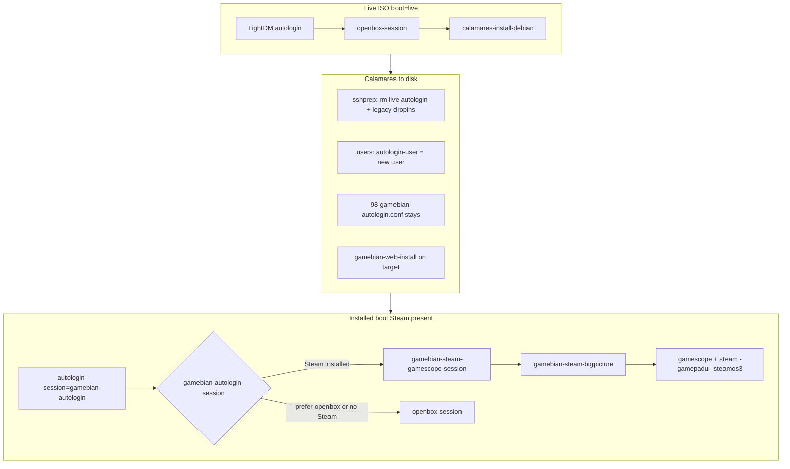

# Steam / gamescope boot and session flow

This document describes how the Gamebian Openbox live ISO boots, installs to disk, and autologins into a gamescope + Steam kiosk when Steam is installed. It matches the scripts under `overlay/includes.chroot/`.

## End-to-end flow



**Important:** When **Steam is installed**, autologin goes **straight to gamescope** (not Openbox). Sign-in and updates happen in Steam Big Picture. **Desktop (Openbox)** is only via the greeter **Desktop** session or `~/.config/gamebian/prefer-openbox-desktop`. Legacy `90-gamebian-openbox-first-session.conf` is never written; sshprep only removes old drop-ins.

---

## Phase 1 — Live ISO

| Component | Path | Role |
|-----------|------|------|
| Live autologin user | `etc/lightdm/lightdm.conf.d/50-gamebian-live-autologin.conf` | `autologin-user=live` (deleted on disk install) |
| Session dispatcher | `usr/local/bin/gamebian-autologin-session` | Live → Openbox; installed + Steam → gamescope |
| Desktop autostart | `etc/skel/.config/openbox/autostart` | lxpanel, NM, notifyd; starts **Calamares** when live |
| Web install (target only) | `Build/share/calamares-gamebian/usr/local/sbin/gamebian-web-install` | APT + pip install `gamebian-web` in installed chroot |
| APT sources helper | `usr/local/sbin/gamebian-ensure-apt-sources` | Enables contrib/non-free before Calamares apt steps |

`steam-installer` is in the squashfs (`overlay/package-lists/openbox.list.chroot`). First-boot terminal logic is **skipped on live** (every relevant script checks `grep boot=live /proc/cmdline`).

### gamescope is not a normal package list entry

**gamescope** is intentionally **not** in `openbox.list.chroot`. On **pure trixie** it is **built from source** (no sid apt). Installed by:

| When | How |
|------|-----|
| ISO build | `hooks/normal/997-gamebian-extra-apt-packages.hook.chroot` → `gamebian-install-gamescope` |
| Disk install | Calamares `shellprocess@gamebian-gamescope` (7200s; skips if ISO already has gamescope) → `/var/log/gamebian-install-gamescope.log` |

See **`docs/DEBIAN-STEAM-GAMESCOPE.md`**. If the build fails (no network, missing deps), `/etc/gamebian/steam-without-gamescope` is set and Steam runs **fullscreen on X without gamescope**.

**On an already-installed system:**

```bash
sudo gamebian-install-gamescope
gamescope --help
gamebian-debug-boot-session
```

Remove fallback mode after a successful install:

```bash
sudo rm -f /etc/gamebian/steam-without-gamescope ~/.config/gamebian/steam-without-gamescope
```

---

## Phase 2 — Fresh disk install

Calamares runs (among others):

1. **`users`** — creates the install user with `doAutologin: true` (writes `autologin-user` for LightDM).
2. **`displaymanager`** — enables LightDM; default greeter session file is `gamebian-desktop` (Openbox).
3. **`shellprocess@gamebian-sshprep`** — removes `50-gamebian-live-autologin.conf` and legacy drop-ins; runs **`gamebian-install-gamescope`**; fixes permissions on session scripts.
4. **`shellprocess@gamebian-web`** — runs `gamebian-web-install` on the target.

Persistent overlay config (survives install):

| File | Settings |
|------|----------|
| `98-gamebian-autologin.conf` | `autologin-session=gamebian-autologin`, `user-session=gamebian-steam` |
| `99-gamebian-sessions-directory.conf` | Greeter lists `/usr/share/gamebian/xsessions/` only |

Greeter sessions:

| `.desktop` | Exec | Visible |
|------------|------|---------|
| `gamebian-desktop.desktop` | `openbox-session` | Yes — **Desktop** |
| `gamebian-steam.desktop` | `gamebian-steam-gamescope-session` | Yes — **Steam** |
| `gamebian-autologin.desktop` | `gamebian-autologin-session` | Hidden — internal autologin |

---

## Phase 3 — Installed boot (Steam → gamescope)

1. LightDM autologins → **`gamebian-autologin-session`**.
2. If **`gamebian_steam_binary_present`** → **`gamebian-steam-gamescope-session`** (no Openbox detour).
3. **`gamebian-steam-gamescope-session`** always starts kiosk when Steam is installed (sign-in / first-run in Steam UI).
4. **`gamebian-steam-bigpicture`** runs gamescope + Steam (`-gamepadui`, `-steamos3`).
5. Optional **Desktop** session: greeter **Desktop** or `touch ~/.config/gamebian/prefer-openbox-desktop` then re-login → Openbox (first-boot terminal, lxpanel, etc.).

**`gamebian-enable-steam-lightdm-session`** still sets markers and `99-gamebian-autologin-steam.conf` when run from Desktop setup or controller menu; autologin no longer waits for those markers before gamescope.

---

## Phase 4 — Gamescope session details

1. **`gamebian-steam-gamescope-session`** sets `GAMEBIAN_GAMESCOPE_SESSION=1`, sources `/etc/default/gamebian-steam-gamescope` and `~/.config/gamebian/steam-gamescope.env`, starts a polkit agent, then **`gamebian-steam-bigpicture`**.
3. **`gamebian-steam-bigpicture`** runs **gamescope** (full compositor in kiosk, not `-e` embed) + Steam with `-gamepadui` and usually **`-steamos3`** so Steam’s power menu can call **`steamos-session-select`**.
4. **Switch to Desktop** (Steam power menu): `steamos-session-select desktop` → **`gamebian-steam-switch-to-desktop`** — in-session handoff only (flag file + stop steam/gamescope); **does not** change next boot unless you run **`gamebian-enable-openbox-lightdm-session`**.

**`steamos-session-select gamescope`** enables Steam preference for **next boot** only; it does not start gamescope in the current session. Use **`gamebian-enter-steam-kiosk-session`** or the controller menu for immediate kiosk.

---

## User marker files

All under `$HOME/.config/` unless noted.

| File | Meaning |
|------|---------|
| `gamebian-firstboot-steam.done` | First-boot wizard completed; autologin may use gamescope |
| `gamebian-firstboot-steam.run-finished` | Steam launcher exited and LightDM Steam preference was enabled successfully |
| `gamebian-firstboot-steam.prompted` | First-boot terminal was already launched once |
| `gamebian/prefer-openbox-desktop` | Force autologin to Openbox even when kiosk is ready |
| `gamebian/switch-to-openbox` | In kiosk session: hand off to Openbox after Steam/gamescope exit |
| `gamebian/in-gamescope-kiosk-session` | Runtime marker while kiosk session is active |

Shared helpers: `usr/share/gamebian/gamebian-steam-ready.sh` (markers, sign-in, poll), `gamebian-steam-kiosk-env.sh`.

---

## LightDM drop-ins

| File | When present | Purpose |
|------|----------------|---------|
| `50-gamebian-live-autologin.conf` | Live ISO only | `autologin-user=live` — **removed on install** |
| `98-gamebian-autologin.conf` | Always (overlay) | `autologin-session=gamebian-autologin`, `user-session=gamebian-desktop` |
| `99-gamebian-autologin-steam.conf` | After first-boot enable | `user-session=gamebian-steam` (greeter default Steam; autologin still uses dispatcher) |
| `99-gamebian-sessions-directory.conf` | Always | Restrict greeter session list to `/usr/share/gamebian/xsessions/` |
| `10-gamebian-lightdm-debug.conf` | Always | Extra LightDM logging |

**Legacy (removed on install, never written by current sshprep):**

- `90-gamebian-openbox-first-session.conf`
- `99-gamebian-steam-session.conf` (old name; different from `99-gamebian-autologin-steam.conf`)
- `88-gamebian-openbox-session.conf`, `97-gamebian-autologin-steam.conf`

---

## Script catalog

### `/usr/local/bin`

| Script | Role |
|--------|------|
| `gamebian-autologin-session` | **Main autologin dispatcher** — live → Openbox; disk + Steam → gamescope |
| `gamebian-lightdm-session` | Legacy hidden dispatcher (`gamebian.desktop`); logic differs — do not use for normal autologin |
| `gamebian-steam-gamescope-session` | LightDM **Steam** session entry; kiosk env + `gamebian-steam-bigpicture` |
| `gamebian-steam-bigpicture` | gamescope + Steam launcher; Openbox fallback when not forced |
| `gamebian-debug-boot-session` | Print effective LightDM config, markers, recent logs |
| `gamebian-debug-lightdm-steam` | LightDM/Steam-focused debug |
| `gamebian-fix-steam-boot` | Root repair: enable steam session + set markers for autologin user |
| `gamebian-controller-menu` | Gamepad quick launcher |
| `steam-installer` | Thin `exec /usr/bin/steam` wrapper |

### `/usr/sbin`

| Script | Role |
|--------|------|
| `gamebian-enable-steam-lightdm-session` | Write `99-gamebian-autologin-steam.conf`, set user markers (root) |
| `gamebian-enable-openbox-lightdm-session` | Remove steam drop-in, set `prefer-openbox-desktop` (root) |
| `gamebian-steam-switch-to-desktop` | Steam “Switch to Desktop” — in-session only |
| `gamebian-enter-steam-kiosk-session` | Start kiosk on current display + enable steam for next boot |

### `/usr/bin`

| Script | Role |
|--------|------|
| `steamos-session-select` | SteamOS API shim: `desktop` → switch-to-desktop; `gamescope` → enable steam LightDM |

### `/usr/share/gamebian`

| Script | Role |
|--------|------|
| `steam-firstboot-terminal.sh` | Before Steam package: install/run Steam, enable LightDM steam preference |
| `gamebian-openbox-notify.sh` | Desktop tips each Openbox login **before** Steam is installed; no-op after |
| `gamebian-steam-ready.sh` | `gamebian_steam_kiosk_ready`, `gamebian_steam_binary_present`, `gamebian_have_loginusers_vdf` |
| `gamebian-steam-kiosk-env.sh` | Kiosk marker, switch-to-openbox, session detection |
| `gamebian-fix-steam-share.sh` | Debian `~/.steam/debian-installation` ↔ `~/.local/share/Steam` symlink |
| `gamebian-session-log.sh` | Append to `~/.cache/gamebian/lightdm-login.log` |
| `gamebian-lightdm-user.sh` | Resolve autologin user home (for root enable scripts) |
| `ensure-apt-contrib-nonfree.sh` | APT contrib/non-free (sourced by `gamebian-ensure-apt-sources`) |

### `/usr/libexec/gamebian`

| Script | Role |
|--------|------|
| `enable-usb-wakeup` | Enable `power/wakeup` on USB ancestors of one device (`%p` from udev) |
| `enable-usb-wakeup-all` | All gamepads + USB root wakeup nodes; used at boot and before suspend |

### systemd / udev

| Unit | Role |
|------|------|
| `lib/systemd/system/gamebian-usb-wakeup.service` | Boot oneshot → `enable-usb-wakeup-all` |
| `usr/lib/systemd/system-sleep/gamebian-usb-wakeup` | `pre` suspend → `enable-usb-wakeup-all` |
| `lib/udev/rules.d/80-gamebian-usb-gamepad-wakeup.rules` | On gamepad connect → `enable-usb-wakeup` |

### Calamares (build tree)

| Script | Role |
|--------|------|
| `gamebian-web-install` | Target: apt deps, pip install gamebian-web, enable services |
| `gamebian-ensure-apt-sources` | Target: contrib/non-free for apt |
| `shellprocess@gamebian-sshprep` | Target: ssh keys, strip live/legacy LightDM, chmod session scripts |

---

## Session switching reference

| Action | Mechanism | Affects next boot? |
|--------|-----------|-------------------|
| Steam → Switch to Desktop | `steamos-session-select desktop` → `gamebian-steam-switch-to-desktop` | No |
| Steam → Return to gaming mode | `steamos-session-select gamescope` → `gamebian-enable-steam-lightdm-session` | Yes (preference only) |
| Controller / menu → Steam kiosk now | `gamebian-enter-steam-kiosk-session` | Yes + starts kiosk on current DISPLAY |
| Greeter → Desktop | `gamebian-desktop` / Openbox | Current login only |
| Greeter → Steam | `gamebian-steam` → gamescope session | Current login |
| `sudo gamebian-enable-openbox-lightdm-session` | `prefer-openbox-desktop` + remove steam drop-in | Yes |

---

## Troubleshooting

```bash
# As the desktop user
gamebian-debug-boot-session
gamebian-debug-boot-session --full

# As root — repair markers + LightDM steam preference
sudo gamebian-fix-steam-boot
```

**Log files:**

| Path | Content |
|------|---------|
| `~/.cache/gamebian/session.log` | gamescope-session decisions |
| `~/.cache/gamebian/steam-bigpicture.log` | gamescope/steam exec lines |
| `~/.cache/gamebian/lightdm-login.log` | session dispatcher entries |
| `~/.cache/gamebian/switch-to-desktop.log` | Switch to Desktop handoff |
| `~/.cache/gamebian/enter-steam-kiosk.log` | enter-steam-kiosk-session |
| `/var/log/lightdm/lightdm.log` | LightDM autologin / session selection |

**Hybrid GPU / gamescope fails:** Copy `etc/skel/.config/gamebian/steam-gamescope.env.example` to `~/.config/gamebian/steam-gamescope.env` and set `GAMEBIAN_VK_ICD_FILENAMES` to AMD RADV (see example comments). Reboot after editing.

**Stuck on Openbox after setup:** Ensure `gamebian-firstboot-steam.done` exists, run `sudo gamebian-fix-steam-boot`, reboot.

**gamescope not installed after reinstall:** Calamares needs network when `gamebian-install-gamescope` runs. Check `/var/log/gamebian-install-gamescope.log`. If `/etc/gamebian/steam-without-gamescope` exists, remove it after a successful install.

**Steam apt errors after old sid pins:** Run `scripts/repair-apt-for-steam.sh`, then `gamebian-install-steam`. gamescope no longer uses sid — **`gamebian-install-gamescope`** builds from GitHub.

**Kiosk loops or black screen:** Check `session.log` and `steam-bigpicture.log`; try `GAMEBIAN_SKIP_GAMESCOPE=1` temporarily in `steam-gamescope.env` to test plain Steam.

---

## Known issues and caveats

1. **Documentation drift (fixed in repo):** Older docs referred to `90-gamebian-openbox-first-session.conf` and `99-gamebian-steam-session.conf` being written by Calamares; current design uses the autologin dispatcher only.

2. **`gamebian-lightdm-session`:** Hidden legacy session; same routing as `gamebian-autologin-session`. Normal installs use autologin only.

3. **`steamos-session-select gamescope`:** Configures next boot; does not enter kiosk immediately.

4. **gamescope on hybrid NVIDIA + Mesa NVK:** Often fails; use `steam-gamescope.env` or proprietary drivers (operational, not a script bug).

5. **Desktop notifications** (welcome, logout→Steam, `http://127.0.0.1:8844`) only while Steam is **not** installed; no Openbox notify logic after `steam` is on disk.

6. **`usr/local/bin/steam-installer`:** Redundant wrapper around `/usr/bin/steam` (harmless).

---

## Related paths in this repo

- Overlay scripts: `Build/gambian-iso/overlay/includes.chroot/`
- Calamares modules: `Build/share/calamares-gamebian/`
- One-shot fix on installed system: `scripts/fix-gamebian-boot-steam-kiosk.sh`
- Profile README: `Build/gambian-iso/README.md`
